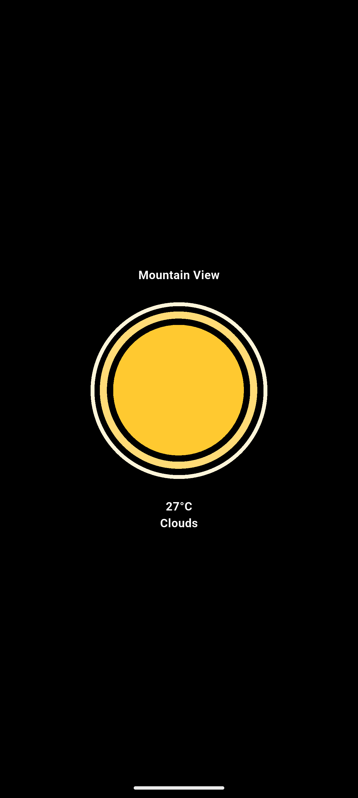
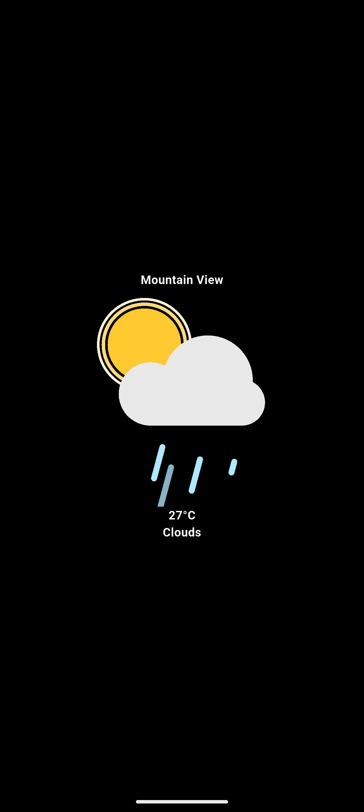
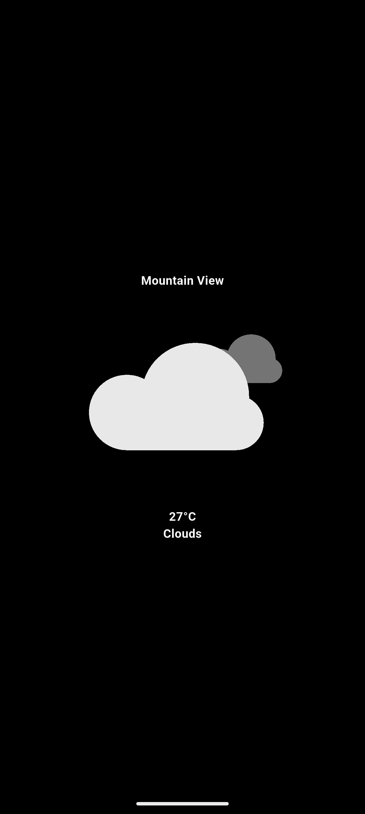
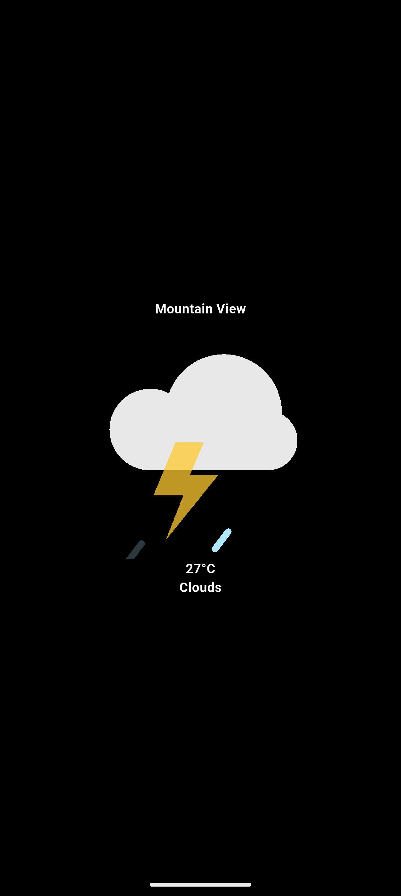

# Flutter Weather App

A simple **Weather application built with Flutter** that allows users to check current weather conditions based on their location.  
The app features a clean and modern user interface, complete with beautiful Lottie weather animations.

---

## Screenshots

| Start Screen | Input | Result |
|-------------|------------|---------------|
|  |  |  |

### Weather Conditions

| Sunny | Shower | Windy | Storm |
|-------|--------|-------|-------|
|  |  |  |  |

---

## Dependencies

- Flutter
- Dart
- `geolocator` (for fetching location)
- `geocoding` (for reverse geocoding)
- `http` (for network requests)
- `lottie` (for weather animations)

---

## Run the Project

```bash
git clone https://github.com/siam4201/weather_app.git
cd weather_app
flutter pub get
flutter run
```
